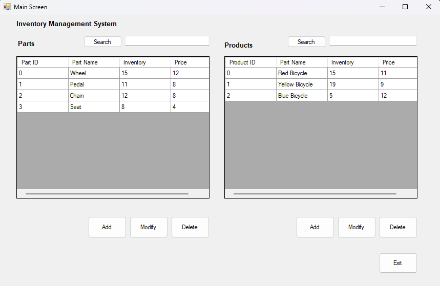
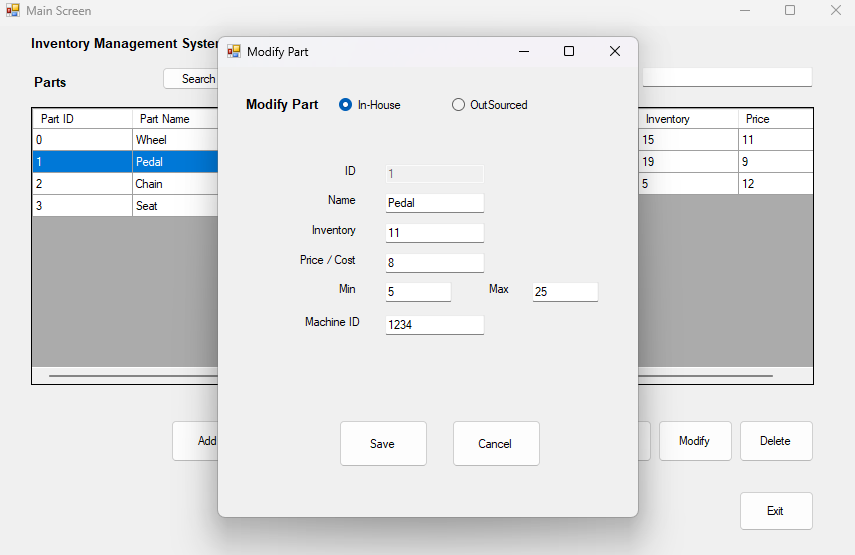
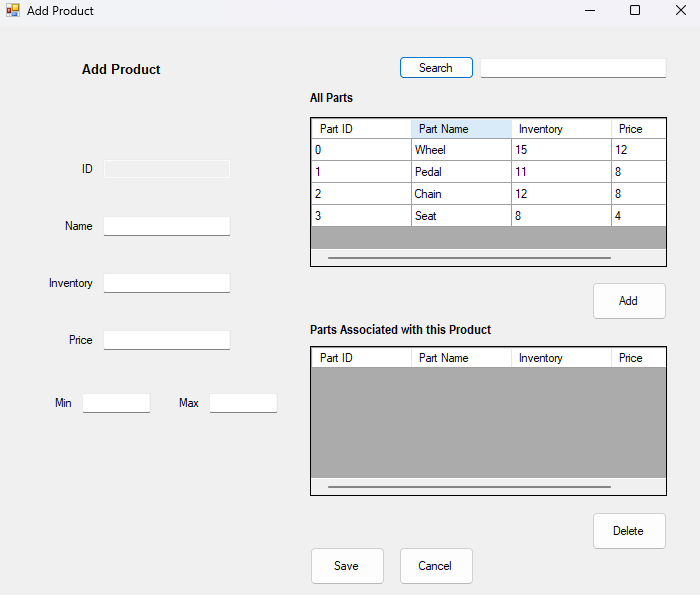

# 📦 Inventory Management System

A Windows desktop application designed to manage inventory, suppliers, and transactions effectively.  
The system allows you to add, update, delete, and search for inventory items while maintaining a clean and easy-to-use interface.

---

## ✨ Features

✔ Manage inventory (add, update, delete, search)  
✔ Supplier management  
✔ Track stock levels  
✔ Sales and restock transactions  
✔ Item categorization  
✔ Search functionality  
✔ User-friendly Windows Forms Interface  
✔ Input validation and error handling

---

## 🖼 Screenshots

> ### 🏠 Dashboard
> 
>
> ### 📦 Parts List
> 
>
> ### 📦 Products
> 

---

## 🛠 Tech Stack

- C#
- .NET Framework (Windows Forms)
- MySQL

---

## 🎯 Why This Project?

#### This project demonstrates:
- Practical implementation of an inventory management workflow
- Desktop application development using Windows Forms
- Data validation and error handling
- Simple but effective user interface for small businesses or personal use
- CRUD functionality

---

## 💡 Future Improvements
- Export inventory reports to PDF/Excel
- Stock alert notifications
- Multi-user login and role system
- Improved search and filtering capabilities